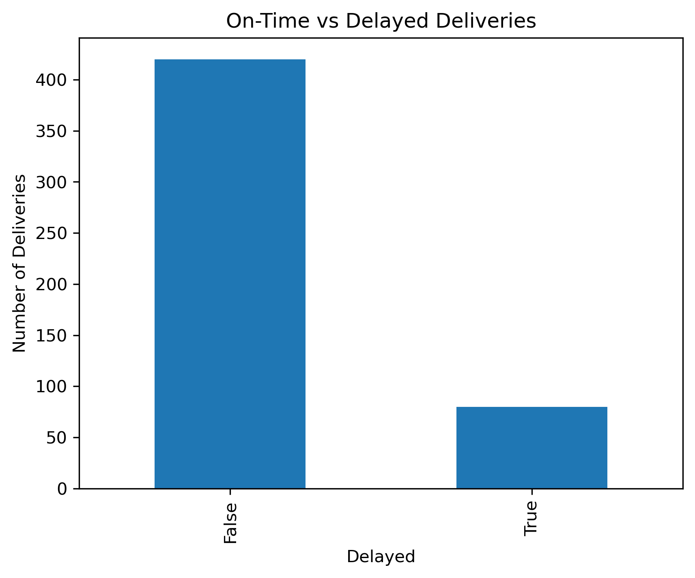

DHL Logistics Performance Analysis

Overview

This project analyzes logistics and delivery performance using simulated DHL-style operational data. The goal is to evaluate delivery efficiency, fuel usage, and delay patterns, and to generate actionable business insights.

Tools Used

Python (pandas, matplotlib, seaborn)

Excel

Jupyter Notebook

Data

The dataset is simulated to reflect real-world logistics operations and includes delivery distance, delivery time, fuel consumption, route, vehicle type, and delay status.

Analysis Performed

Data cleaning and preparation

Exploratory Data Analysis (EDA)

KPI analysis (delivery time, delays, fuel efficiency)

Data visualization

Key Insights

Identified routes with higher delay frequencies
Observed fuel consumption patterns relative to distance
Highlighted opportunities for route optimization and improved scheduling

Sample Visualisations

On-Time vs Delayed Deliveries

Comparison of on-time and delayed deliveries, highlighting overall delivery performance and reliability.

Fuel Consumption Vs Distribution

Distribution of delivery times showing typical completion windows and potential delay outliers.

Outputs

This repository includes the Jupyter notebook used for analysis and sample charts generated from the data.
