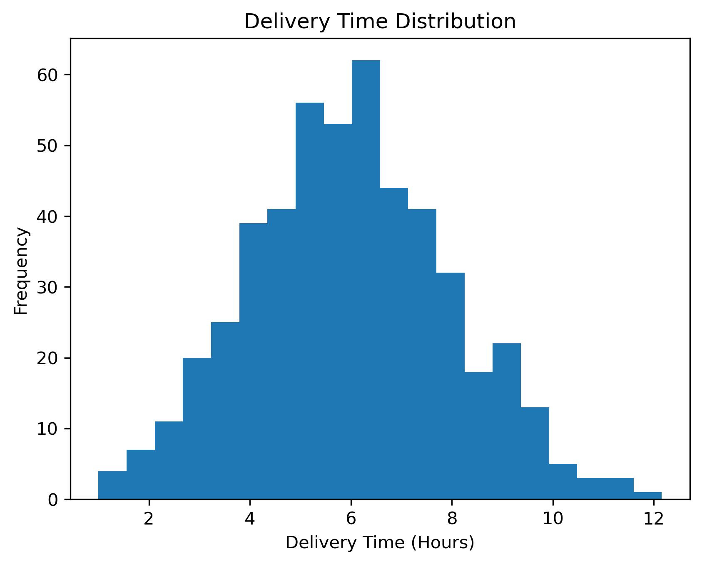

### DHL Logistics Performance Analysis

## Overview

This project analyzes logistics and delivery performance using simulated DHL-style operational data. The goal is to evaluate delivery efficiency, fuel usage, and delay patterns, and to generate actionable business insights.

## Tools Used

Python (pandas, matplotlib, seaborn)

Excel

Jupyter Notebook

## Data

The dataset is simulated to reflect real-world logistics operations and includes delivery distance, delivery time, fuel consumption, route, vehicle type, and delay status.

## Analysis Performed

Data cleaning and preparation

Exploratory Data Analysis (EDA)

KPI analysis (delivery time, delays, fuel efficiency)

Data visualization

## Key Insights

Identified routes with higher delay frequencies
Observed fuel consumption patterns relative to distance
Highlighted opportunities for route optimization and improved scheduling

## Sample Visualisations

## On-Time vs Delayed Deliveries

Comparison of on-time and delayed deliveries, highlighting overall delivery performance and reliability.

## Fuel Consumption Vs Distribution

Relationship between delivery distance and fuel consumption, revealing key logistics cost drivers.

## Average Delivery Time by Route

Comparison of average delivery times across routes to identify efficient and underperforming routes.

## Business Recommendations (Chart-Linked)

On-Time vs Delayed Deliveries: Prioritize operational reviews on delayed shipments to improve overall service reliability.

Delivery Time Distribution: Adjust delivery windows and scheduling to reduce outliers causing excessive delays.

Fuel Consumption vs Distance: Optimize long-distance routing and delivery consolidation to control fuel costs.

Average Delivery Time by Route: Focus improvement efforts on consistently underperforming routes to enhance efficiency.

Delay Rate by Vehicle Type: Deploy more reliable vehicle types on time-sensitive routes to reduce delivery delays.

## Outputs

This repository includes the Jupyter notebook used for analysis and sample charts generated from the data.
